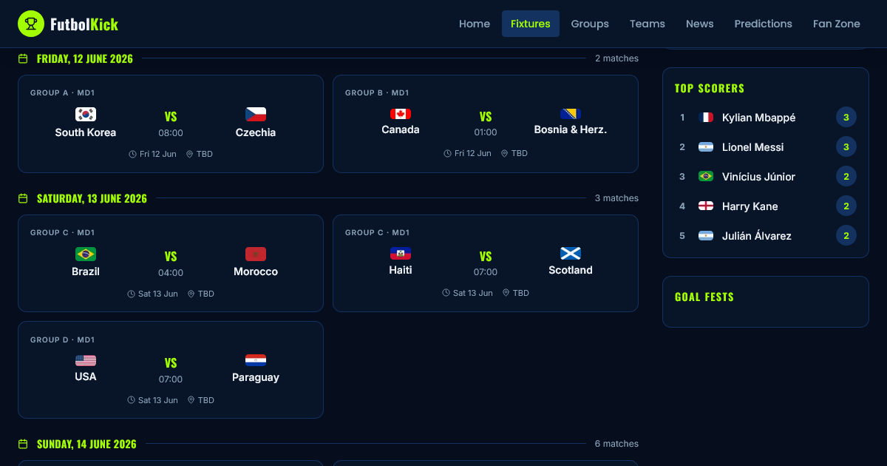

# FutbolKick

FIFA World Cup 2026 football blog — fixtures, standings, team profiles, match previews, news, and fan content.

## Screenshot



## Tech Stack

- **Next.js 16.2.6** (App Router, fully static)
- **React 19** + **TypeScript**
- **Tailwind CSS 4**
- **lucide-react** for icons
- Fonts: Oswald (headings), Poppins (display), Inter (body)

## Pages

| Route | Description |
|---|---|
| `/` | Homepage — live matches, upcoming fixtures, latest news |
| `/fixtures` | Filterable fixtures list with search and group/stage filters |
| `/groups` | All 6 group standings overview |
| `/groups/[group]` | Full group table, team cards, fixtures (A–F) |
| `/teams` | All 24 teams with search and filter |
| `/teams/[team]` | Team profile — squad, formation, tactics, WC history, fixtures |
| `/matches/[id]` | Match preview — form, H2H, key battles, predicted score, fan poll |
| `/news` | News listing — featured articles, categories |
| `/news/[slug]` | Full article with related posts and prev/next navigation |
| `/fan-zone` | Fan hub — polls, fan stories, leaderboard, watch guide |
| `/predictions` | 4-step prediction form saved to localStorage |
| `/sitemap.xml` | Auto-generated sitemap (79 routes) |
| `/robots.txt` | Crawler rules |

## Project Structure

```
app/                    # Next.js App Router pages
├── page.tsx            # Homepage
├── fixtures/           # Fixtures listing
├── groups/             # Groups overview + [group] detail
├── teams/              # Teams listing + [team] detail
├── matches/[id]/       # Match preview pages
├── news/               # News listing + [slug] article pages
├── fan-zone/           # Fan zone hub
├── predictions/        # Prediction form
├── sitemap.ts          # Dynamic sitemap
└── robots.ts           # Robots rules
components/             # Shared UI components
lib/
└── data.ts             # All data + TypeScript types + helper functions
```

## Data

All data lives in `lib/data.ts`:
- 24 teams across 6 groups (A–F) with full squads, tactics, and WC history
- 30 fixtures with scores, venues, and status
- 6 group standings tables
- 7 news articles

## Getting Started

```bash
npm install
npm run dev
```

Open [http://localhost:3000](http://localhost:3000).

## Build

```bash
npm run build
```

Generates 79 fully static routes with no server-side rendering required.

## SEO

- Per-page `title` and `description` metadata
- Open Graph tags on all pages
- Schema.org JSON-LD on team pages (SportsTeam), match pages (SportsEvent), and articles (NewsArticle)
- Auto-generated sitemap and robots.txt
